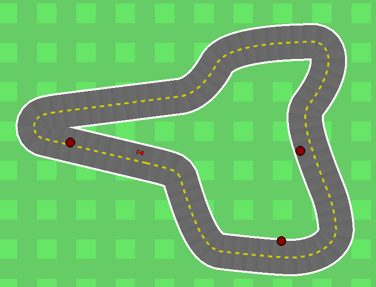

# Learning to drive by predicting the future

Code used for the master's thesis "Learning to act by predicting the future".



Modifications to CarRacing can be found in [car_racing.py](gym/envs/box2d/car_racing.py)

## Gym

Gym is an open source Python library for developing and comparing reinforcement learning algorithms by providing a standard API to communicate between learning algorithms and environments, as well as a standard set of environments compliant with that API. Since its release, Gym's API has become the field standard for doing this.

Gym currently has two pieces of documentation: the [documentation website](http://gym.openai.com) and the [FAQ](https://github.com/openai/gym/wiki/FAQ). A new and more comprehensive documentation website is in the works.

## Citation

A whitepaper from when OpenAI Gym just came out is available https://arxiv.org/pdf/1606.01540, and can be cited with the following bibtex entry:

```
@misc{1606.01540,
  Author = {Greg Brockman and Vicki Cheung and Ludwig Pettersson and Jonas Schneider and John Schulman and Jie Tang and Wojciech Zaremba},
  Title = {OpenAI Gym},
  Year = {2016},
  Eprint = {arXiv:1606.01540},
}
```

## Release Notes

There used to be release notes for all the new Gym versions here. New release notes are being moved to [releases page](https://github.com/openai/gym/releases) on GitHub, like most other libraries do. Old notes can be viewed [here](https://github.com/openai/gym/blob/31be35ecd460f670f0c4b653a14c9996b7facc6c/README.rst).
